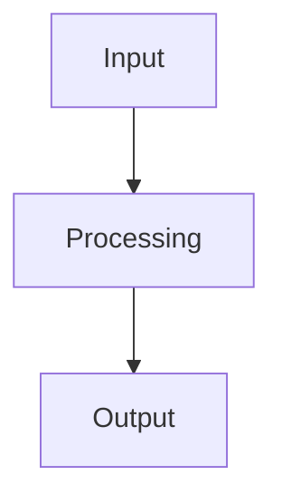
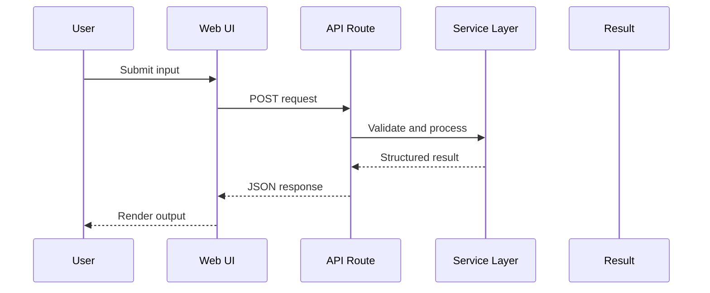

# README Generation Skill

## Purpose

Generate a high-quality `README.md` that feels polished, useful, and repo-specific. The README should help a visitor understand what the project does, why it matters, how to run it, how to use it, how it works internally, and how to contribute.

Use this skill for:

- Creating a new README from repository files.
- Rewriting an existing README into a cleaner, more impressive version.
- Adding missing sections such as installation, usage, API reference, deployment, screenshots, roadmap, security, troubleshooting, and license.
- Making a README feel professional without becoming generic or bloated.
- Producing README content for Claude Code, OpenCode, Codex, or any coding agent workflow.

## Core Style

Write like a strong open-source maintainer:

- Clear, direct, confident.
- Modern but not cringe.
- Helpful before flashy.
- Specific to the repository.
- No fake claims.
- No generic marketing filler.
- No unsupported badges, metrics, screenshots, demos, sponsors, or integrations.
- Avoid em dashes. Use commas, colons, or short sentences instead.
- Prefer concise paragraphs and scannable tables.
- Use emojis sparingly for section headers and navigation, not every sentence.
- Keep code blocks copy-pasteable.
- Keep headings stable and linkable.

## README Quality Bar

A strong README should answer these questions fast:

1. What is this project?
2. Who is it for?
3. What problem does it solve?
4. Why should someone trust or try it?
5. How do they install it?
6. How do they run it locally?
7. How do they configure it?
8. How do they use it?
9. What does the output look like?
10. How is the project structured?
11. How does the system work internally?
12. How do they test, build, deploy, and troubleshoot it?
13. How do they contribute?
14. What license/security policy applies?

## Input Discovery Workflow

Before writing, inspect the repository when possible.

Read these files first if present:

- `package.json`, `pnpm-lock.yaml`, `yarn.lock`, `package-lock.json`
- `README.md`
- `LICENSE`
- `.env.example`
- `.gitignore`
- `Dockerfile`, `docker-compose.yml`
- `next.config.*`, `vite.config.*`, `tsconfig.json`, `tailwind.config.*`
- `src/`, `app/`, `pages/`, `components/`, `lib/`, `server/`, `api/`
- `.github/workflows/`
- `docs/`
- screenshot or media folders such as `public/screenshots/`

Extract facts only from real files. If something is missing, either omit it or mark it as `TODO`, depending on usefulness.

## README Structure Template

Use this structure when it fits the project. Remove sections that are not relevant.

```markdown
# Project Name

> One strong sentence that explains the project and its value.

<p align="left">
  <!-- Badges here -->
</p>

> Optional live demo or primary CTA.

---

## 🧭 Quick Links

| Link | Description |
| --- | --- |
| 🌐 Live demo | Hosted app or docs |
| 📦 Repository | Source code |
| 🐛 Issues | Bug reports and feature requests |
| 📄 License | License file |

---

## 🗂️ Table of Contents

- [Overview](#overview)
- [Features](#features)
- [How It Works](#how-it-works)
- [Repository Structure](#repository-structure)
- [Tech Stack](#tech-stack)
- [Requirements](#requirements)
- [Installation](#installation)
- [Configuration](#configuration)
- [Usage](#usage)
- [API Reference](#api-reference)
- [Testing](#testing)
- [Deployment](#deployment)
- [Roadmap](#roadmap)
- [Contributing](#contributing)
- [Security](#security)
- [License](#license)

---

## Overview

Explain the problem, the solution, and the target users.

## Features

- Specific feature with concrete value.
- Specific feature with concrete value.
- Specific feature with concrete value.

## How It Works

Use a Mermaid diagram when architecture or flow matters.



## Repository Structure

```text
project/
├── app/
├── components/
├── lib/
└── README.md
```

## Tech Stack

| Layer | Choice |
| --- | --- |
| Framework | ... |
| Language | ... |
| Styling | ... |
| Database | ... |

## Requirements

- Node.js version
- Package manager
- API keys or optional services

## Installation

```bash
git clone REPO_URL
cd PROJECT
npm install
npm run dev
```

## Configuration

| Variable | Required | Description | Example |
| --- | --- | --- | --- |
| `API_KEY` | No | Used for ... | `xxx` |

## Usage

Show UI usage, CLI usage, API usage, or library usage depending on the project.

## API Reference

Document endpoints, request body, response body, and errors if the project exposes an API.

## Testing

```bash
npm run lint
npm run typecheck
npm run test
npm run build
```

## Deployment

Add Vercel, Docker, self-hosted, or platform-specific steps.

## Roadmap

- [ ] Useful planned improvement
- [ ] Useful planned improvement

## Contributing

Give clear contribution steps.

## Security

Explain how to report vulnerabilities and any security posture.

## License

MIT, Apache-2.0, GPL, proprietary, or TODO if missing.
```

## Badge Rules

Badges should be real, useful, and not overloaded.

Good badge categories:

- Live demo
- License
- Version
- Stars
- Issues
- Pull requests
- Last commit
- Language
- Framework
- Build status, only if a workflow exists
- Package version, only if published

Do not add badges for things that are not true or not verifiable.

Example badge block:

```html
<p align="left">
  <a href="LIVE_DEMO_URL"></a>
  <a href="LICENSE_URL"></a>
  <a href="REPO_URL"></a>
</p>
```

## Tone Patterns

Use strong one-liners:

- `Turn messy repository context into clean, usable documentation.`
- `Scan fast, fix faster.`
- `Built for maintainers who want clarity before release day.`
- `No signup. No noise. Just the report.`
- `A clean developer experience for a messy developer problem.`

Avoid weak lines:

- `This is a powerful and innovative tool.`
- `This project revolutionizes everything.`
- `The best solution for everyone.`
- `A cutting-edge platform leveraging modern technologies.`

## Architecture Section Rules

Add architecture only if it helps.

Use `flowchart TD` for app/data flow.
Use `sequenceDiagram` for request lifecycle.
Use simple labels, not implementation essays.

Example:



## Repository Structure Rules

Do not dump every file. Show the important shape.

Include comments that explain purpose:

```text
project/
├── app/                 # Routes, layouts, and server endpoints
├── components/          # Reusable UI components
├── lib/                 # Core logic, helpers, and types
├── public/              # Static assets and screenshots
├── scripts/             # Automation scripts
└── README.md            # Project documentation
```

## API Documentation Rules

If an API exists, include:

- Method and endpoint.
- Purpose.
- Request body.
- Successful response shape.
- Error response shape.
- Stable error codes.
- Example request.

Use concise tables for fields and errors.

## Screenshots Rules

Only include screenshot links if files exist.

Good:

```markdown

```

If screenshots are missing but valuable:

```markdown
> TODO: Add screenshots for the landing page, main workflow, and result view.
```

## Security and Trust Rules

For security tools, devtools, scanners, auth tools, data tools, or AI tools, include a clear trust section.

Mention only true guarantees:

- Read-only behavior.
- No persistence.
- Local-only processing.
- Secret masking.
- Optional authentication.
- Rate limits.
- Privacy boundaries.

Never claim:

- Perfect security.
- Complete vulnerability detection.
- No false positives.
- Compliance certification unless verified.

## TODO Rules

Use TODO notes when the README references something that should exist but is missing:

```markdown
> TODO: Add a top-level `LICENSE` file before the first public release.
```

Keep TODOs useful and limited.

## Output Requirements

When asked to generate a README:

1. Return a complete `README.md`.
2. Preserve accurate facts from the repo.
3. Add `TODO` only for missing files or unknown values.
4. Use Markdown that renders cleanly on GitHub.
5. Include commands that match the actual package manager and scripts.
6. Include environment variables only if discovered or requested.
7. Keep the final README cohesive, not a collection of fragments.

When asked to improve an existing README:

1. Keep accurate existing information.
2. Remove duplicated or noisy sections.
3. Upgrade structure, headings, tables, examples, and CTA.
4. Fix broken image paths or clearly mark them as TODO.
5. Replace generic copy with repo-specific copy.
6. Keep the project’s branding and voice.

When asked for a compact README:

1. Keep only title, tagline, badges, overview, features, quick start, usage, tech stack, license.
2. Avoid long architecture, roadmap, and API sections unless essential.

## Final Self-Check

Before returning the README, verify:

- The title matches the repository.
- The tagline is specific and useful.
- Badges point to real project URLs.
- Install commands match detected scripts.
- Configuration variables match `.env.example` or source usage.
- No fake screenshots, fake demos, fake tests, or fake package names.
- Code fences have correct languages.
- Mermaid diagrams are valid enough to render.
- The table of contents matches actual headings.
- Security, license, and contribution sections do not overclaim.
- No em dashes.
